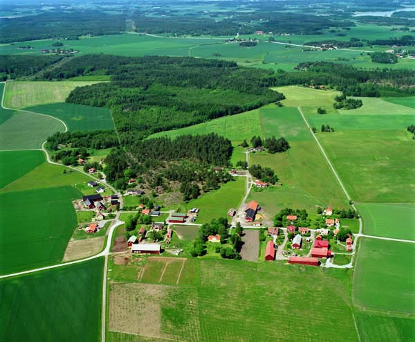
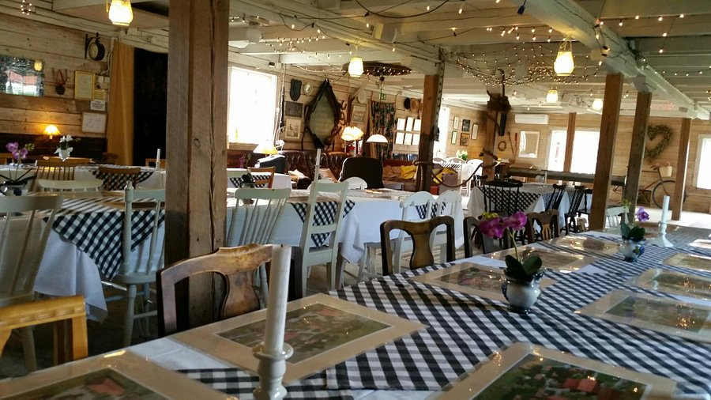

Hier findest Du Infos dazu, wann die Hochzeit stattfindet, wo und wie wir feiern werden.

# Wann findet die Hochzeit statt?
- Die Hochzeit ist am 30. Juli 2022, also schnell im Kalendar eintragen.
- Der genaue Zeitplan für den Tag ist noch in der Planung. Fest steht schon, dass die Festlichkeiten um 14:30 Uhr beginnen werden. Geplant sind eine herzliche Hochzeitszeremonie, leckeres Essen, Bar und Tanz bis in die Nacht.
```
14:30: Start der Festlichkeiten
14:30-03:00 Details noch in der Planung
03:00: Die letzten Partytiger gehen ins Bett
```

# Wo findet die Hochzeit statt?
Die Hochzeit feiern wir auf Brunnsta Gård, der Farm von Magnus’ Familie ```nördlich von Stockholm in Schweden```.



- Wir freuen uns, Euch auf einen gemütlichen, traditionell schwedischen Bauernhof einzuladen, um dort gemeinsam zu feiern.
- Brunnsta Gård liegt in Brunnsta, 35 Minuten Autofahrt von Arlanda (Stockholm) Flughafen und 45 Minuten Autofahrt vom Hauptbahnhof in Stockholm.
- Link zum Standort auf Google maps: [https://goo.gl/maps/eZr5uCdtZGmvyNR56](https://goo.gl/maps/eZr5uCdtZGmvyNR56)



# Hotels und Übernachtung

Ein paar Gäste können vor Ort auf Brunnsta Gård übernachten, aber die meisten Gäste werden in einem Hotel in der Nähe übernachten müssen. 

Brunnsta Gård:
Wir haben die ca. 20 Betten vor Ort reserviert. Buchung geht nur über uns - gedacht vorrangig für Familien mit kleinen Kindern. Bei Interesse bitte bei uns melden.

Hotelempfehlung und Rabatt-Code:.
Wir haben einen Rabatt Code organisiert für das Welcome Hotel in Barkarby, ca. 30 Minuten von Brunnsta Gård. Das Hotel liegt auf halben Weg nach Stockholm und ist daher auch geeignet, falls jemand ein paar extra Tage in Stockholm dranhängen möchte. Bitte bucht die Zimmer direkt über das Hotel. Es sind verschieded Zimmergrössen verfügbar.

Welcome Hotel in Barkarby / Welcome SPA
Notarievägen 5
177 46 JÄRFÄLLA
Telefon: +46 (0)8 621 61 00
Website: https://www.welcomehotel.se/en
Discount Code: mmwedding

```Wir planen einen Shuttle Service zu organisieren, der Euch vom Welcome Hotel abholt und zu bestimmten Zeiten wieder ins Hotel bringt. Falls Ihr Euch für eine andere Unterkunft entscheidet, müsstet Ihr den Transport selber z.B. mit Taxi organiseren.```

# Was (anziehen)?
Es ist uns am wichtigsten, dass Du kommst, nicht so sehr was Du anhast. Wenn Du Dich schick machen möchtest, dann kannst Du das gerne machen, aber wir lieben Dich auch einfach dafür, dass Du kommst und mit uns feierst.
